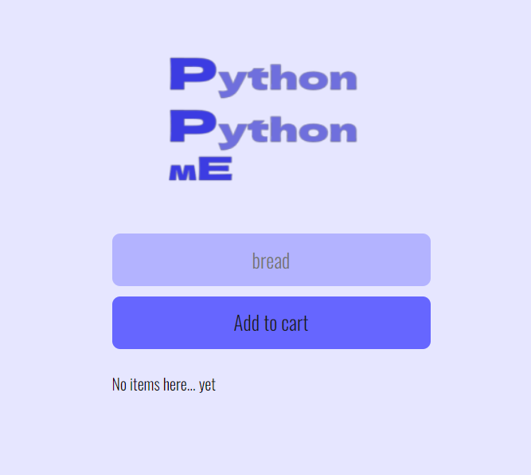
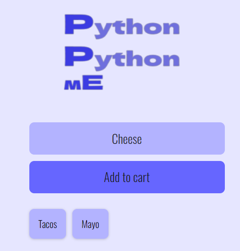
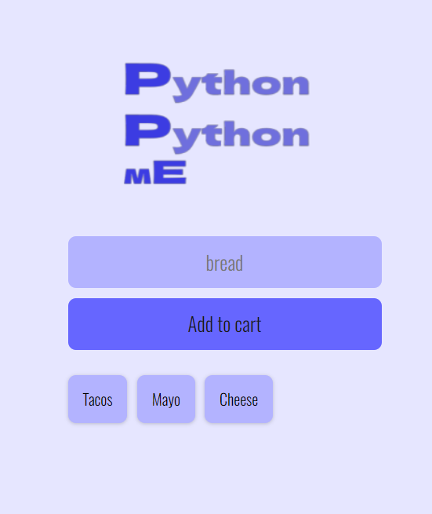
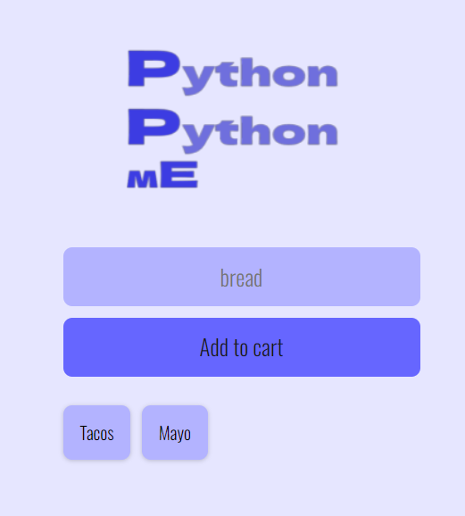

# Add to shopping list App
This is a shopping cart App which lets users add and delete items while shopping.

# Requirements
To run this web app, you will need to have Javascript,Html,Css.
This App runs on FireBase Db and fetches data in realtime.

# Usage
To enable list for shopping.

# Credits
This web app was created following the codecamp tutorial by Rafid Hoda @Scrimba.
* https://scrimba.com/learn/firebase

* https://www.youtube.com/watch?v=UFD4SP91tSM&ab_channel=freeCodeCamp.org

# License
This project is licensed under the MIT License - see the LICENSE file for details.

# Demo

* Main UI

* Adding Items

* Deleting elements, click on the item u want to delete.

* Update is reflected.

